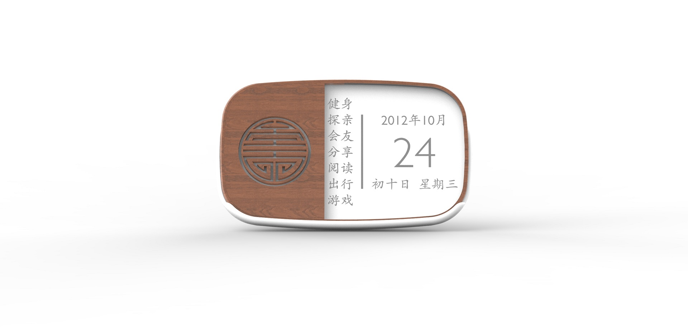
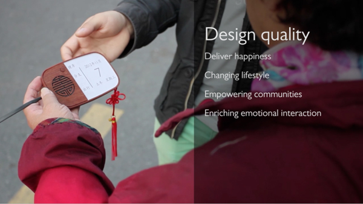
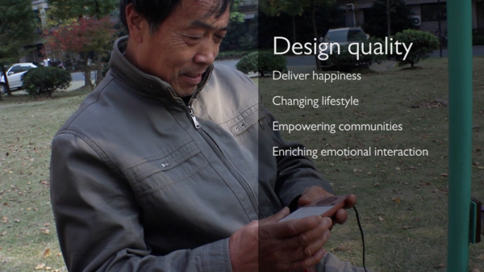
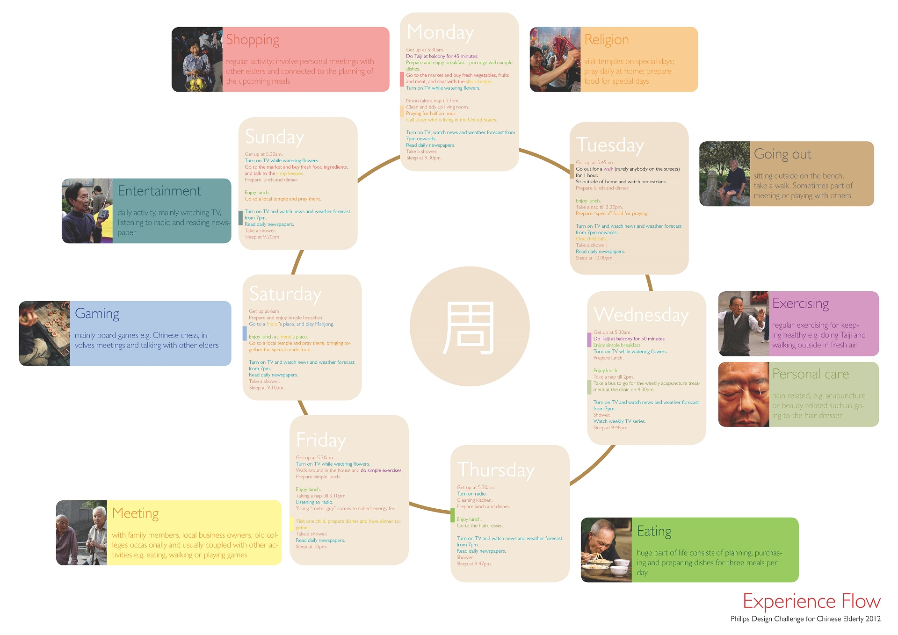
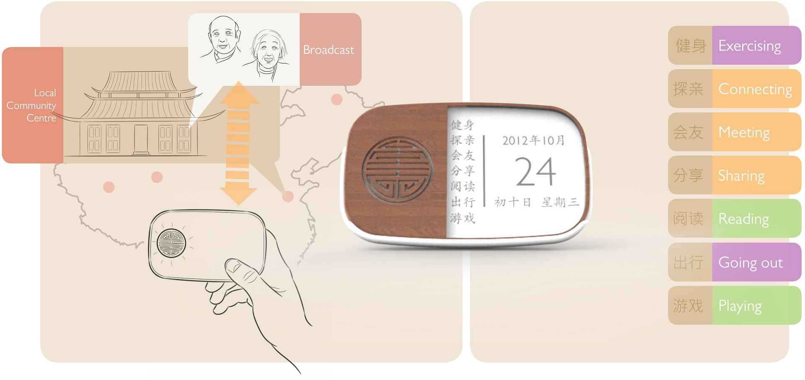

HappyLongLiving is a product-service system designed for Chinese market, which aims to motivate elders to engage more with local communities as well as to boost their physical activeness. By using a unique almanac and a local-organized radio, the device helps maintain elders' mental well-being.

Global aging is an issue that calls for innovative and meaningful solutions. Together with local stakeholdrs, emerging challenges can be solved jointly. In this project, the target group is 55+ Chinese people: without higher education, living alone and recently retired - stepping into a new phase in their lives. Next to their decreasing physical conditions, their mental well-being is also at risk.

HappyLongLiving is a product-service system, which aims to motivate elders to engage more with local communities as well as to boost their physical activeness. The key features consist of calendar function and radio function. Its calendar function which originates from traditional Chinese almanac prompts during daily use, and suggests activities from seven categories with emphasis of socialization. Next to the regular radio function, the device can connect to local community radio station where other seniors are broadcasting and sharing their stories and experiences. These moments create a tight social bond between the similar age group, which can motivate the less active members to participate and eventually lead to their mental well-being.

[[kgWidthWide]]
| 

[[kgWidthWide]]
| 

[[kgWidthWide]]
| 

[[kgWidthWide]]
| 

[[kgWidthWide]]
| 
