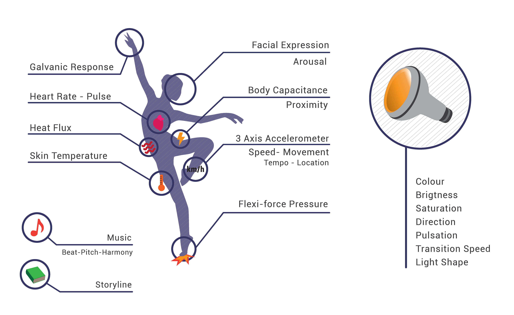
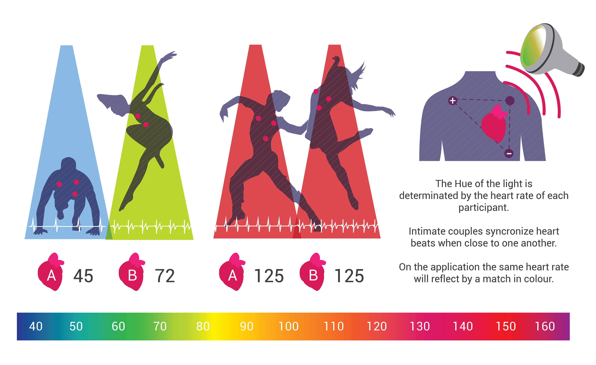
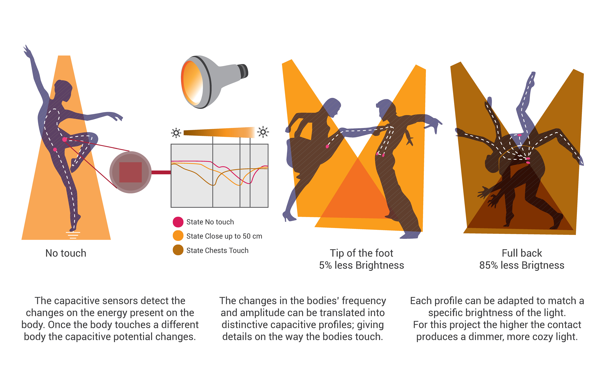
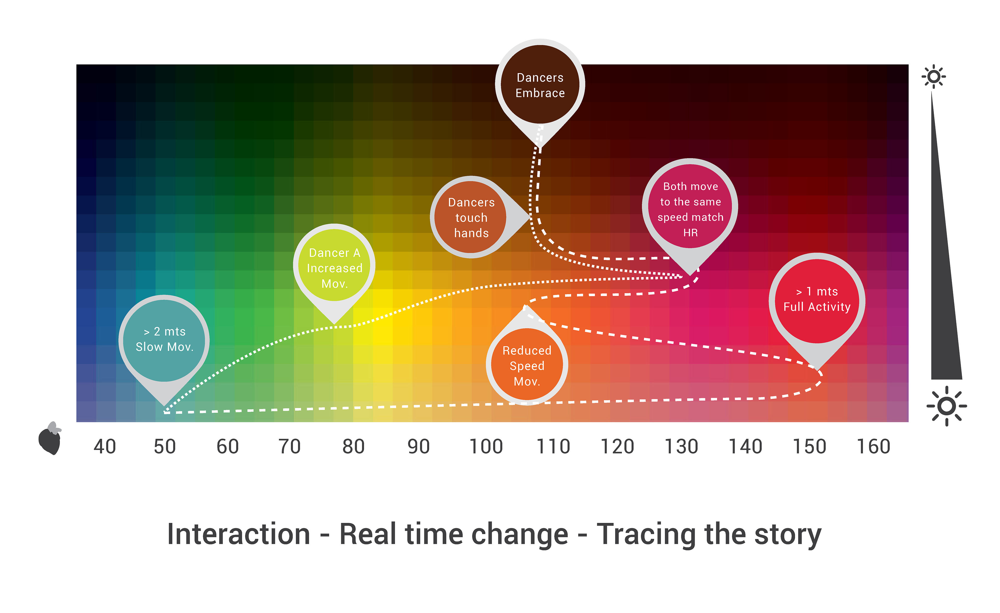

> **Client**
>
> [Philips Research](http://www.research.philips.com)
>
> **Designers**
>
> Carolina Gomez Naranjo, Dominika Potuzakova, Kimberly Schelle, [Zhiyuan Zheng](/)

[[kgWidthFull]]
| `vimeo:87562851`

#### Making visible the invisible
New ways of self-expression

#### Stimulate the intimacy between dancers
Adjust atmosphere to enhance intimacy

#### Connecting experiences
Create a new setting for social sharing with non-verbal communication

[[kgWidthWide]]
| 

[[kgWidthWide]]
| 

#### Physio-pleasures
Increased visual pleasure
Light environment enhances tatile pleasures

#### Socio-pleasures
Visibility of internal responses
New layers of expression and possible interpretations
Deeper knowledge of partner - stronger connection

#### Psycho-pleasures
Strengthened emotions
Being more in character in the story
Seeing more inside oneself

[[kgWidthWide]]
| 

[[kgWidthWide]]
| 
