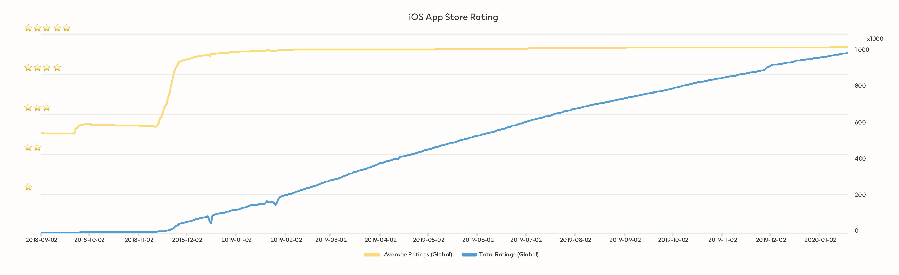
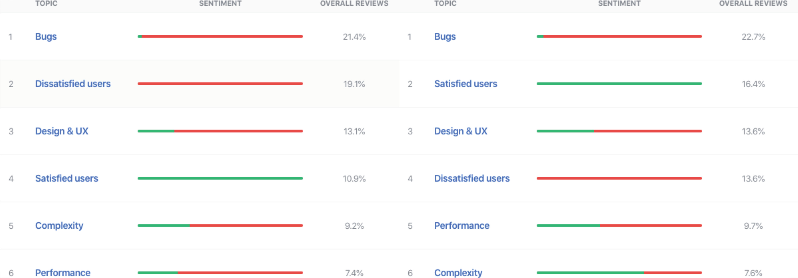

Mobile first has been proven as a successful strategy in some markets while the rests are catching up, how do we fast forward H&M's app experience while maintaining the core business idea and its ongoing operation?

Together with product owner, we break down this ambitious goal into tangible design and development tasks. Most importantly, how could we keep track of the outcome of our hypothesis of roadmap?

[[kgWidthFull]]
| `youtube:THhk5eVqyoY`
| ###### © H&M Group production

"KPIs" are required to be redefined into customer centric matrix as a first step. Followed by understanding stakeholders' goals as well as internal processes. A 3-stage roadmap is drawn by connecting all the dots which contain detailed tasks that the development team can consume in an iterative process.

The first stage of the roadmap is concluded at the end of the year. Our hypothesis is greeted with customers' satisfactory that gives us the confidence of speeding up improving our customer offerings. Stay tuned.

[[kgWidthFull]]
| 

[[kgWidthWide]]
| 
