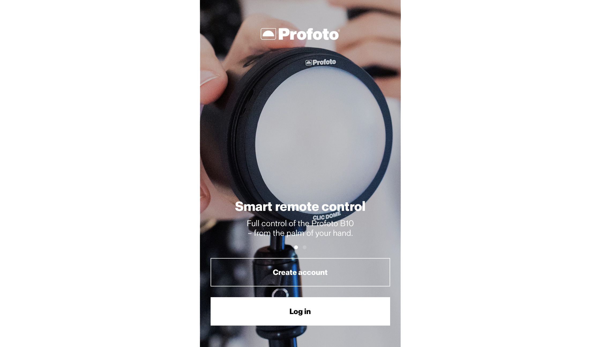
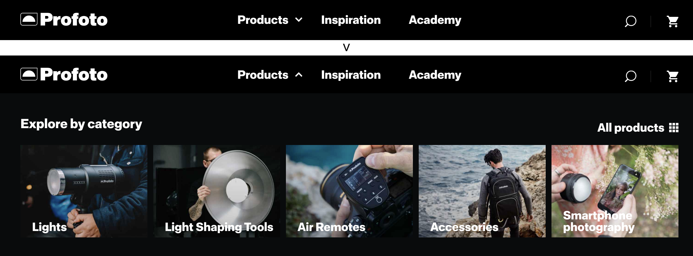
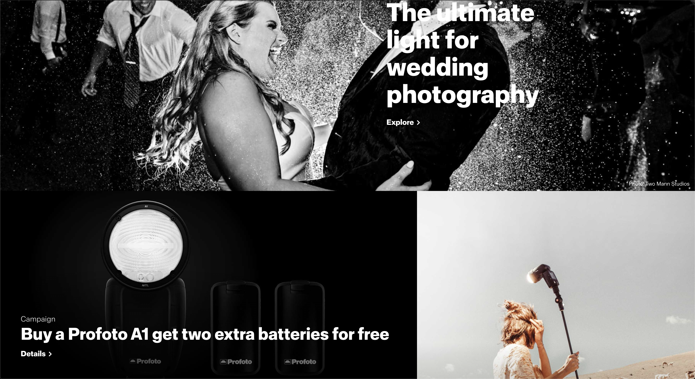
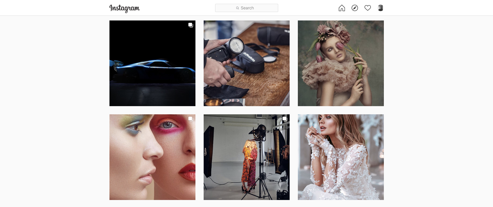
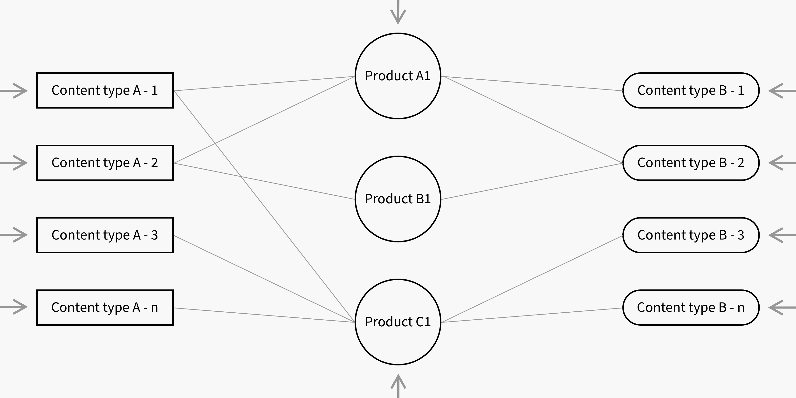
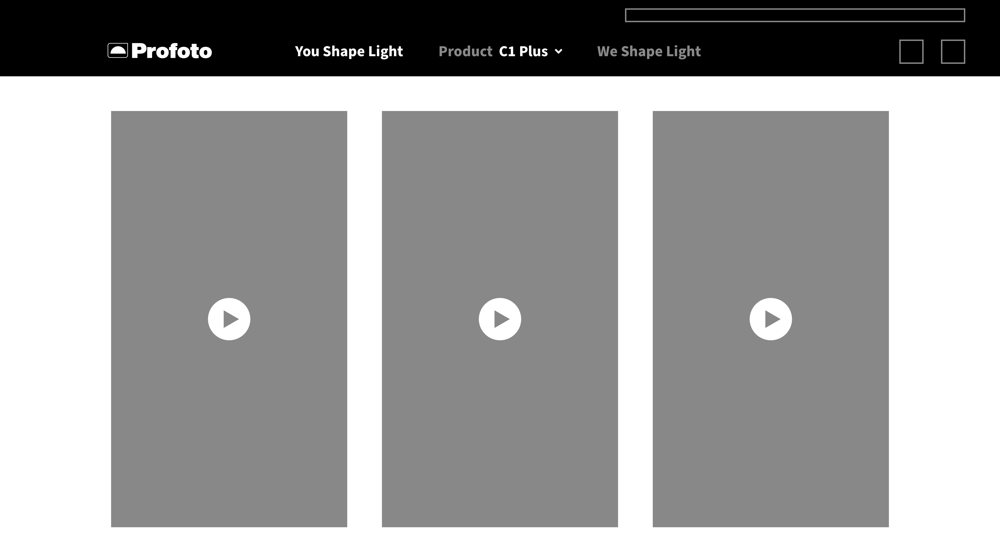
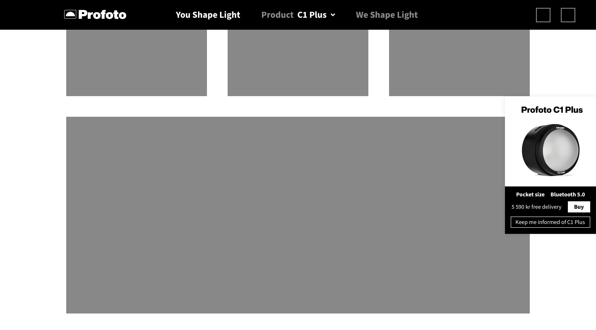
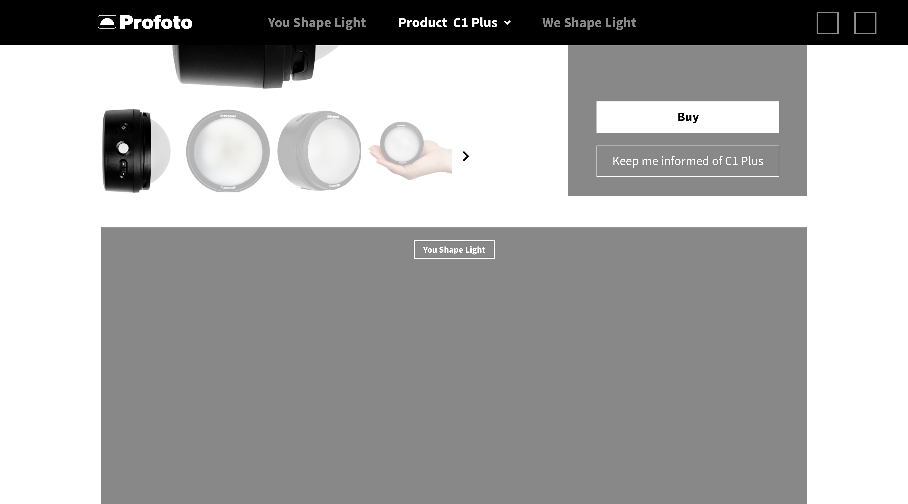
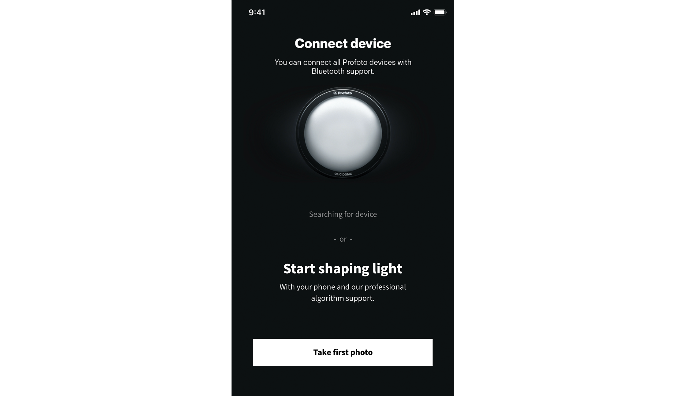
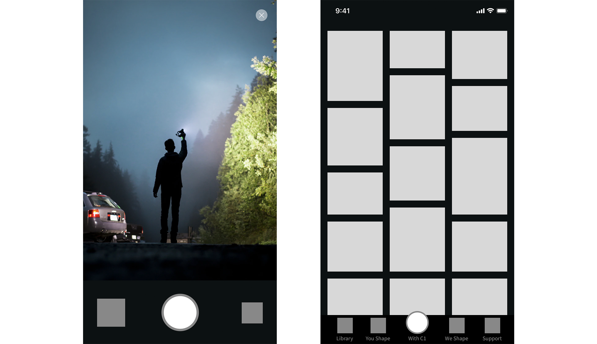

import EmbedVideo from "components/mdx/embedVideo";
import EmbedImage from "components/mdx/embedImage";

> ###### Cover photo credit [Nadine Shaabana](https://unsplash.com/@nadineshaabana) on [Unsplash](https://unsplash.com/s/photos/light)

# Who is Profoto?

`"Who is Profoto?"` This will be the first question asked by the potentials customers whom we would like to reach out to. This will also be the most important first impression that defines the relationship going forward.

With above guiding principle, this case will focus on defining the very first customer journeys where **trust** and **knowledge** are built up.

## My first encounter with Profoto

Few weeks back when I received Profoto's job ad through LinkedIn, I got quite excited about the company behind and started to understand it right away, through the most common channel nowadays - Google Maps and its website.

<EmbedVideo
  width="wide"
  host="youtube"
  source="ML_GqzFptYM"
  title="My first encounter with Profoto"
/>

Above demonstrates how I as an ordinary potential customer discovers that Profoto has an app! Although when screen recording, it was not my first time visiting the website, I still could not remember (understand) how to find back the app. Questions then arise in my head, `who is Profoto` and what are they trying to sell to me?

# Continuous research

Markets are rapidly changing, forming one of the reasons for Profoto's new growth potentials. For me, research should not be just a mean to solve a certain problem; rather, it should be carried out on a daily basis, to reflect, to aggregate, dicovering social context transformations.

## Understand target customers

In practice, it is important to reach out directly to customers to understand deeper of their behaviours and desire, though challenging in current crisis. For this case's purpose, market benchmarking with information provided by Profoto will be used.

References include both in the professional market as well as consumer market.

### Professional market

For the professional market, two Swiss companies are found, Elinchrom and Broncolor. Both of them have a website only for reference purpose, meaning they are there only when people would like to take a look.

Their approach aligned with my assumption and experiences that, in this market, reputation and loyalty are the key towards success. Unlike tech world where reputation and loyalty are also digitalised, here reputation spread among other means like word of mouth, trade fairs or print media.

This group does have a constant need of upgrade, keeping up with the standard once in a while. The potential emerge during this gap, when if their attention can be caught, there is opportunity to convert. The keyword is `change`.

### Consumer market

For consumer market, [Scandinavian Photo](https://www.scandinavianphoto.se/) is referenced who holds both online and offline stores.

Different from professionals, general consumers might or might not have in depth knowledge about the actual technical advances of each single product. The ultimate goal is to understand how this product can enhance my capability and experiences. A great example is how [Instagram](https://www.instagram.com/) emerged. Its success is not about that it is another camera app, but it helps people produce better photos. The keyword here is `understand`.

### If I'm at Profoto

Imagining bringing my practices to Profoto for these two major target customers, I would look into existing data such as online tracking, customer follow ups, etc., to validate assumptions above.

For professional consumers, I would like to get to know some of them; observe how they work, and dig deeper into when they would consider a change for something different. For general consumer market, we would need to start fresh as there is not much baseline at the moment. Trying out various approaches and rapidly adapting to new findings.

# Evaluation and reflection

## `Change`

For both existing and potential professional customers, maintaining the relationship is what we should grab in between the periods when the change happens. Their decision moments are unlikely at right before their purchase, but rather long before this moment. How could we design solutions and services that invite this group to connect with Profoto?

## `Understand`

For general consumers who don't know Profot, or even don't know much about the importance of lighting with photography, the approach should be to help them understand how they can become better in their capability. People change from old iPhones to new iPhones with dual or triple cameras not because they know the tech details of all of them, but they expect that they can produce better photos thanks to Apple's "innovation". And this is what we should focus on for this group of customers.

## Current solutions

<EmbedImage width="wide">

</EmbedImage>

Navigation helps users to understand what can they expect from this website or digital information board. Looking at the current navigation, it does not satisfy either the need of `change` or the need of `understand`. Further, it happens quite often that internally we understand how we define our contents, but would an outsider understand the difference between "inspiration" and "academy" without going further?

_As a professional customer, how would I get to know the latest of technology being developed, and latest changes within the industry so that I am prepared for my next upgrade?_

_As a general consumer, when I am landed to the website from an external source, how can I get to know the way to become better in my capability with your product?_

<EmbedImage width="wide">

</EmbedImage>

Similar for the app, if we intend to use it as a channel rather than just a complementary tool to the flashes, can we satisfy both `change` and `understand` needs when they start the app? Even, if logging in is a must step to satisfy my needs?

# Proposal

## Optimization before renovation

To be able to cater for two major customer needs, major renovation is needed. This includes but not limited to, examine the channels towards customer today and how to redefine them, study the content strategy and how could we produce contents based on the needs, and ultimately how do we make sure customers' needs are satisfied whenever they visit us?

These changes require efforts, time and collaboration internally. While preparing for this major renovation, optimizations can be done already to improve the current setup.

## Digital vs physical

Different from the physical world we are in, digital worlds are inter-linked and open. People today are using tons of services online, and come and go in a blink of eyes. There is no more a set starting point from the homepage, but rather, what we invest quite a lot on the SEO and others are bringing customers into any place of the website, or anypart of the app if deeplinking is supported.

<EmbedImage width="wide">

</EmbedImage>

What we need to support our visitors is that, no matter where they land on the website:

1. Objective: People need to understand why they are looking at this => Key result: Reduce bounce rate
2. Objective: What they can do more with us => Kkey result: improve session duration and return rate

That in mid or long run will lead to convertion. This is important as Profoto is producing high-end products that purchase decisions are rarely being made within only one session of visit. Though compared with a physical store, the threshold of visiting a digital store is heavily reduced. This is the chance where we can increase relationship with potential customers.

## The optimizations

<EmbedImage width="wide">

</EmbedImage>

_Hypothesis: What if we expand by default our product selection so that any visits can understand what we do?_

A very simple and fast A/B test can be launched to evaluate if the perception of brand and products are improved.

<EmbedImage width="wide">

</EmbedImage>

_Hypothesis: What if we align all clickable image based stories to the same interaction pattern to improve click through rate?_

Another example of fast and simple improvement that we can learn about if increased hospitality leads to better relationship building.

The list continues, with the support of behavioural data tracked, hypothesis can be set up to follow effects of our target.

## The renovation

<EmbedImage width="wide">

</EmbedImage>

As visting in the digital world comes from all directions, it is important to support all the visits with a clear content structure through e.g. navigation and supporting links. Going forward when we further embrace the content creators, the amount and diversity of contents will explode, thus also requires a foundation to guide all the creativities.

<EmbedImage width="full">

</EmbedImage>

The core of Profoto are the leading lighting, light shaping products and knowledge. Assuming `Content type A` is the new content type for general consumers, where possibly there are multiple connections to different product groups per content. Through both visual as well as clear definition, this group of customers would wander between multiple `Content type A` and multiple product groups during each session, until their next visit to be kept updated.

From professional customers' perspective, `Content type B` is the new group of contents that are targeting them with much more in-depth technical and industry updates. These contents might have less connections with certain product group, but we expect these visits to stay longer within each created content. Nevertheless, this group of customers should also be able to wander between `Content type B` and core products, and if they wish, be inspired from `Content type A` as well.

After the contents are structured, tagged and well linked on-site, similar strategy can be expanded to external communications, social media, creating a seamless browsing experience and strong connection to core product groups whenever and wherever our customers are.

<EmbedImage width="wide">

</EmbedImage>

To illustrate this principle, as an example, the main navigation on site will reflect above strategy. For instance we can name `Content type A` as "You Shape Light", aiming towards general consumers where `understand` is their goal of explorating Profoto. This illustration showcases when a general consumer lands on this content page, from external source such as search engine. The content type naming is highlighted and throughout their browsing journey, as well as the hero product connected to this content, such as "C1 Plus". Although this visitor might not understand what "C1 Plus" means at this moment. But it already sets an impression of our core product in their mental knowledge. Until next time he/she reads "C1 Plus" again, this useful content will pop up in their mind.

<EmbedImage width="wide">

</EmbedImage>

To enhance this mental moddel, hero product will be shown with higher visibility than today, opening up possibilities to link to the core product (group) at any moment. As explained previously, we could not assume actual conversion would happen in just one visit without prior knowledge about photography lighting. Therefore same importance as the "Buy" button, we invite this visitor to subscribe to updates if they are interested. This reduces the threshold of the need of logging in, but also help us connect this visitor to `Content type A` with a focus on "C1 Plus". Later on in our communication with this potential customer, we can make use of our clear content strategy from inside outwards, to strengthen their desire to convert eventually.

<EmbedImage width="wide">

</EmbedImage>

Same principle will be implemented on the core product page as well, weighing the same importance of direct conversion and build the relationship.

Here on the core product (group) page, connections are provided as well to either `Content type A` and/or `Content type B` with their common names. With the help of online tracking and personalisation, we can prioritize the order of the contents shown in this page, increasing the probability for longer session duration and page visits, which in most of the case means higher loyalty and trust.

These are just few possibilities out of many, based on a clear content strategy with the understanding of differences between various customer groups. Internally, clearer content structure also eases the workload that people can spend more time on understanding changing customer's needs as well as market shifts, and be able to create rapid content updates based on these insights.

<EmbedImage width="wide">

</EmbedImage>

Before jumping in to the setup of the content display of the app, we need to ask ourselves, why do we think anyone would download our app? And if our assumption is correct?

Talking about my first encounter with Profoto that I accidentally found out the app, I downloaded it as well and kept it for merely 10 minutes. My reflections on my own behaviour later on are:

- I don't have any gadget from Profoto and cannot make the best out of this app
- There is no added value of the camera function, I would rather go back to the one I am used to
- What are tutorials and academy? I did not expect to view tutorials when I download the app
- I expected something different, but what is it?

When thinking about similar situations, examples can be given such want-to-be-Instagram-rival [VSCO](https://vsco.co/). Using it for several years, only as a simple photo editing app before posting to Instagram. They also struggle for many years, trying to compete with Instagram of its social feed but failed. The argument behind is that, [VSCO](https://vsco.co/) does provide a much better photo editing experience, but that is the only goal when someone downloads their app - that is the match between what a customer wants with what the app can provide.

In the context of Profoto, I love its slogan "the light shaping company". But this slogan is reflected very well with its physical products, but not yet the digital products. Imagine if I am the one looking to shape light with Profoto, can I achieve this goal before I own any of the products?

With this said, the welcoming experience should focus on both, the professionals who use the app as a complementary tool, as well as anyone who would like to know more about shaping light with Profoto. For both, logging in is definitely not what they would expect as a requirement of shaping light. In the illustration above, both options are presented for the first time user of the app. With a simple tap for anyone, the journey of discoverying light shaping begins.

<EmbedImage width="wide">

</EmbedImage>

What is the added value of Profoto app if I am not yet an owner of any Profoto products? Can I have more control over lighting (more than white balance and exposure) that I cannot have with stock camera app? Can I even simulate some lighting effects of some selected Profoto flashes? Can you teach me how to shape light through the camera function?

All these expectations result in a more powerful photo shooting experience. With the help of long adopted iOS tab bar navigation structure, we will place taking photo at the center for the experience, with of without any owned Profoto flashes. Surrounded by the same navigation of website that reduces the need of learning of customers no matter where they are. And most importantly, deeplinking can be easily achieved when the content structure and app and web matches.

## Closing words

Understanding customers = reflecting about who we are and what we do. I believe it is a great opportunity of Profoto expanding the importance of light to large audiences, to whom light is the source of how we all see and understand the world.