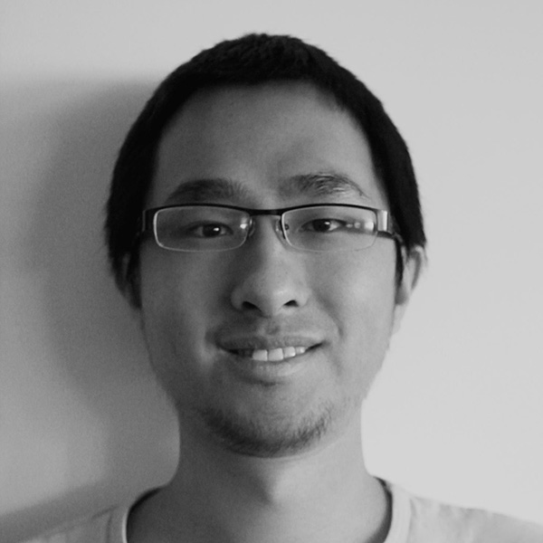

<EmbedImage classes='avatar'>

</EmbedImage>

A passionate and experienced product designer with a cross-cultural background of China 🇨🇳, the Netherlands 🇳🇱 and Sweden 🇸🇪. Constantly reaching out to experience cultural differences, and further reflecting upon the perception between human, human and machine.

Technologies advance in an effort to bridge people closer, reduce further workload. However, do people truly feel the connectedness among each other? How do I as a designer, when experiencing these rapid updates, propose what is actually beneficial for a societal transformation?

Let's explore together! I will bring along my key competencies:

Cross-cultural design / Experience design / Design thinking / Product Development

Feel free to grab my [résumé](./resume-Zhiyuan_Zheng.pdf) 😊.
