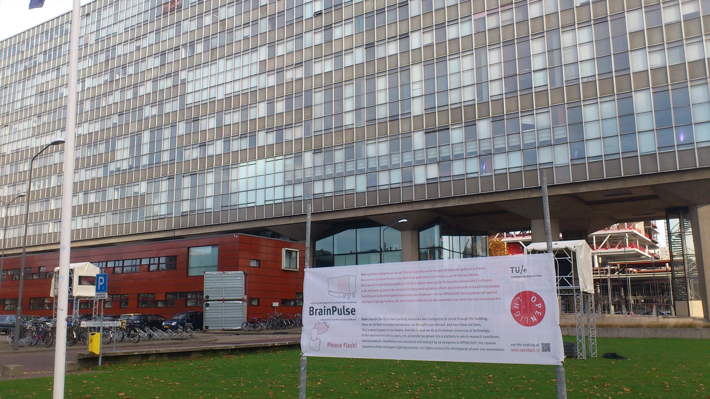
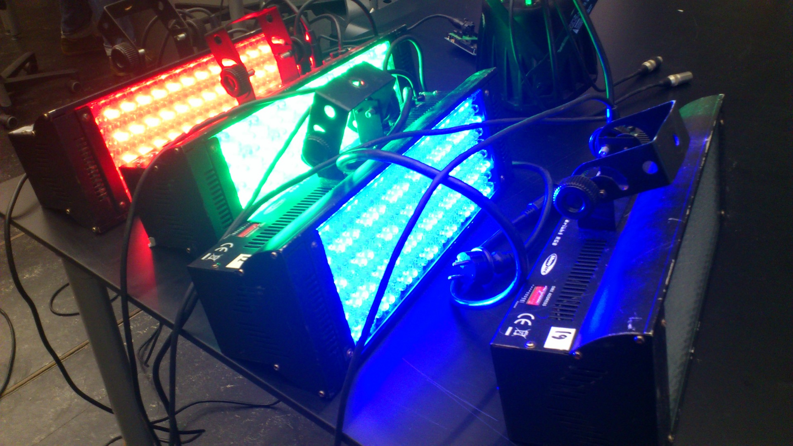
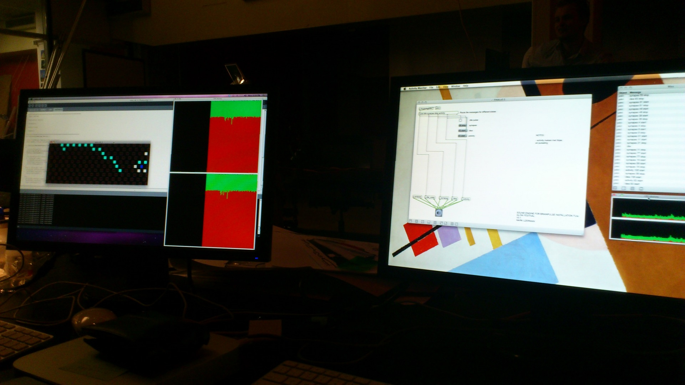
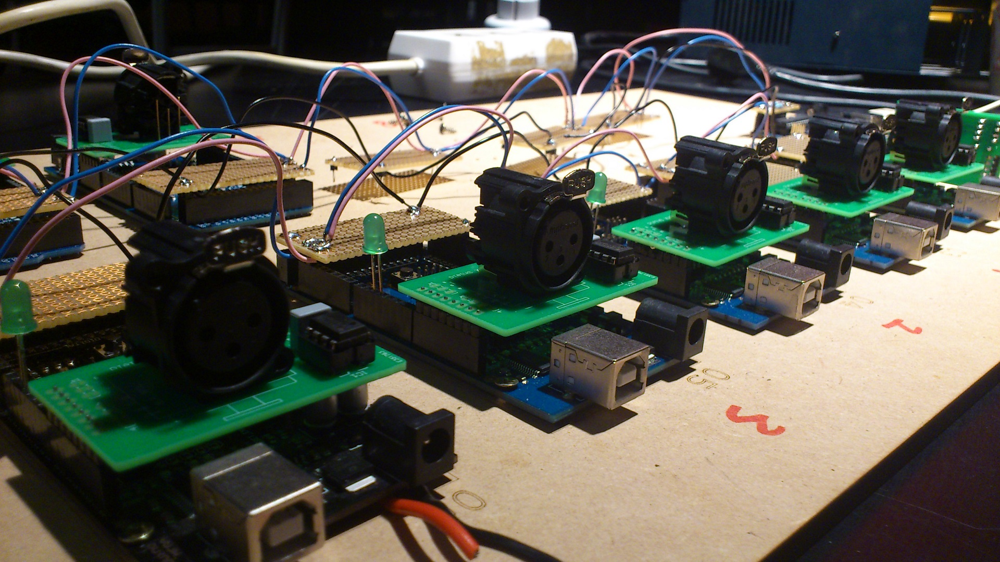
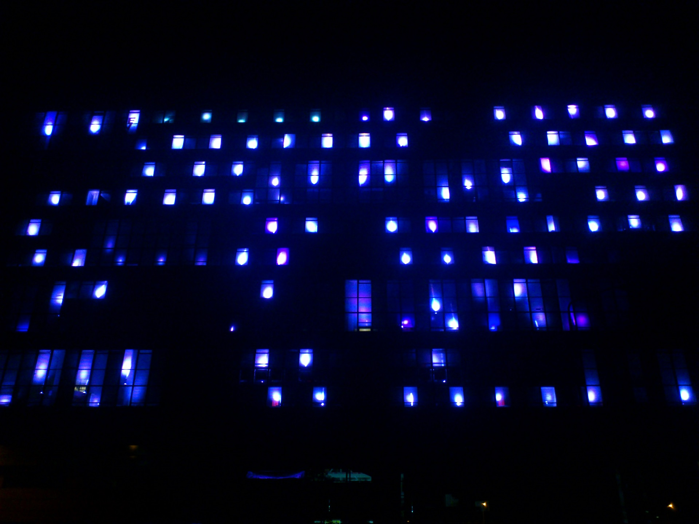

import EmbedVideo from "components/mdx/embedVideo";
import EmbedImage from "components/mdx/embedImage";

> ### Client
> [GLOW Eindhoven](https://www.gloweindhoven.nl/), [OPENLIGHT](http://rombout.design/openlight/www.openlight.nl/index.html)
> ### Designers
> [Zhiyuan Zheng](/), Martijn Kelderman, Jeroen Peeters, Hugo Christiaans, Hank, Marco van Beerts, Jorg de Bont, Nadine, Vivian, Lian, Matthijs, Bianca, Meerthe, Frits, Thomas, Vincent, Teun Vinken, Erik Swaagstra, Rob, Bart, Jurrian, Idowu, Sander, Kevin, Maxwell, Lilly Chong
> ### Supervisors
> Kees Overbeeke, Philip Ross, Remco Magielse, Marcel van Heist, Rombout Frieling

<EmbedVideo
  width="wide"
  host="vimeo"
  source="32866239"
  title=""
/>

The TU/e has widespread connections with society and industry, and is able to use these connections to give direct meaning to scientific discoveries in the region. With the recent "Brainport smartest region in the world" proclamation, where the TU/e plays a large role, as an example.

This connecting quality the TU/e has, will be reflected during GLOW through an interactive installation on the main building's facade. The installation allows visitors to experience the mind of the researchers: 222 lamps translate the building into an enormous "brain".

Visitors are invited to use their cameras to flash towards the main building's 'brain' to create new brain waves, connecting the waves and to give birth to new ideas.

<EmbedImage width="wide">

</EmbedImage>

<EmbedImage width="wide">

</EmbedImage>

<EmbedImage width="wide">

</EmbedImage>

<EmbedImage width="wide">

</EmbedImage>

<EmbedImage width="wide">

</EmbedImage>