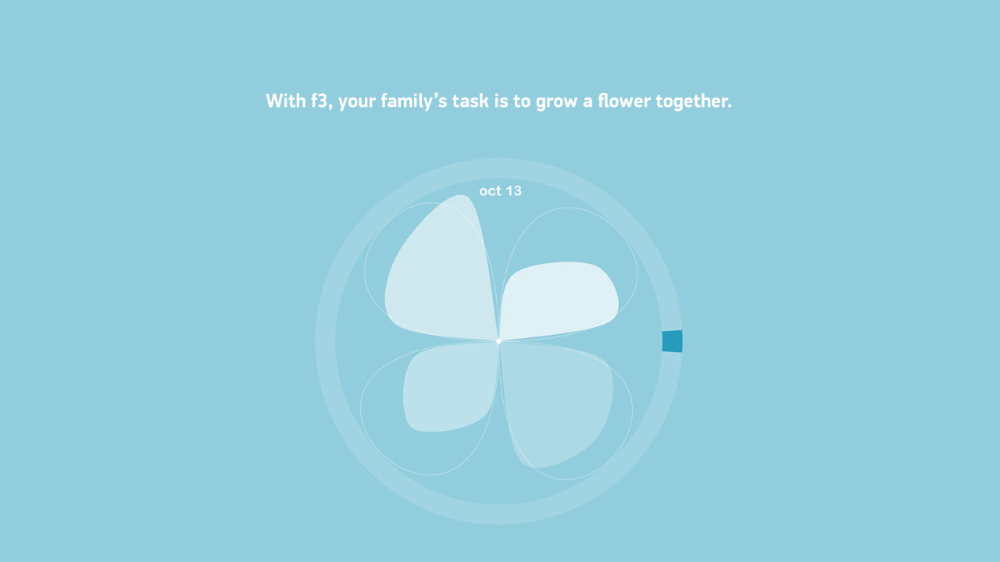
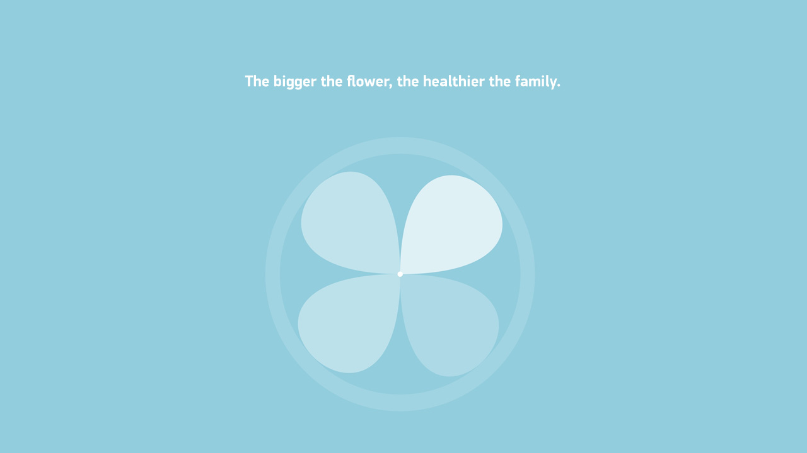
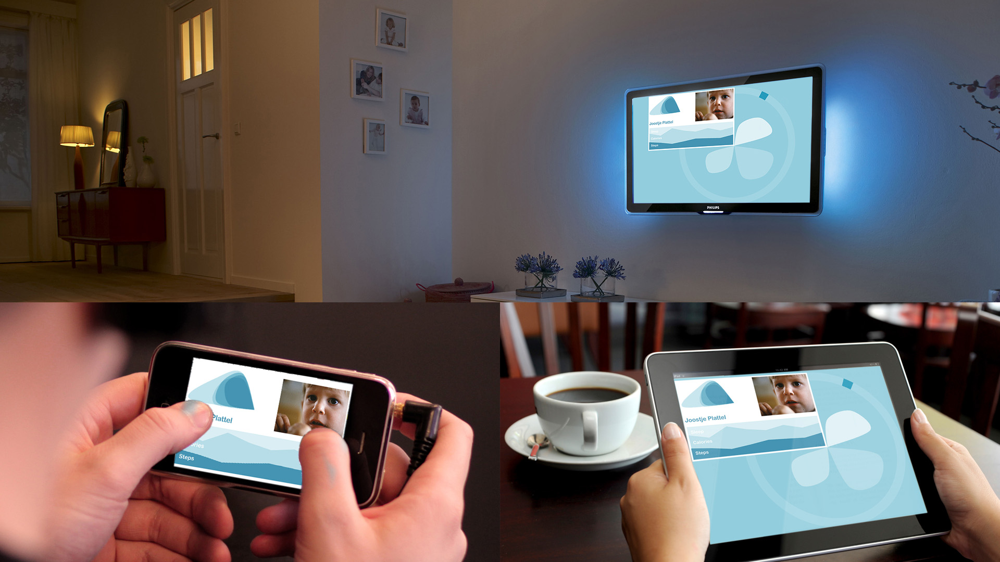

> ### Workshop
> Big Data Hackathon
> ### Organizer
>[Philips Design](http://www.design.philips.com)
> ### Designers
> Laurens, Joostje, Marieke, Thomas, Ulrich, [Zhiyuan Zheng](/)

Everyone knows what to do to live healthy,
Yet most of us have trouble sticking to their resolution,
We need the right drive to change our behaviour,
That drive is our family and big data.

**What if**
Kids don't fuss about their Brussels sprouts..
Dad sticks to quitting smoking..
Mom runs an extra mile..

family.feels.fine helps families change behaviour for a healthier lifestyle and makes it fun doing it together.

<EmbedImage width="wide">

</EmbedImage>

<EmbedImage width="wide">

</EmbedImage>

<EmbedImage width="wide">

</EmbedImage>

<EmbedImage width="wide">

</EmbedImage>