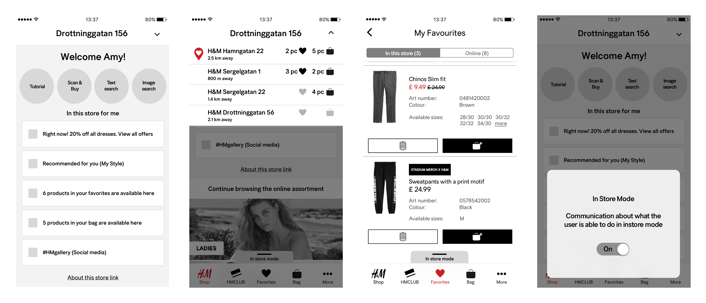
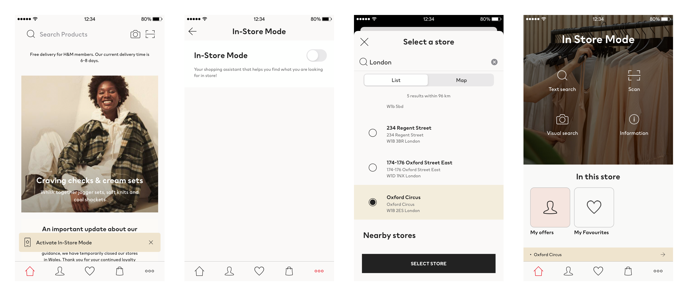
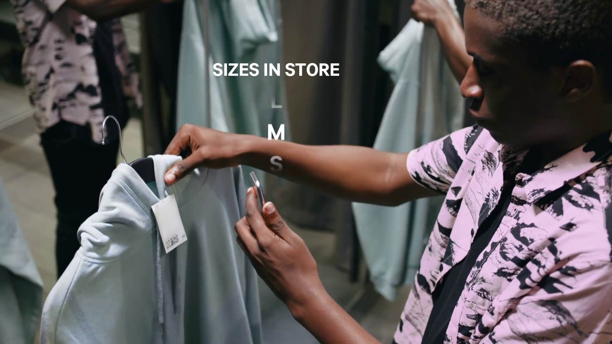
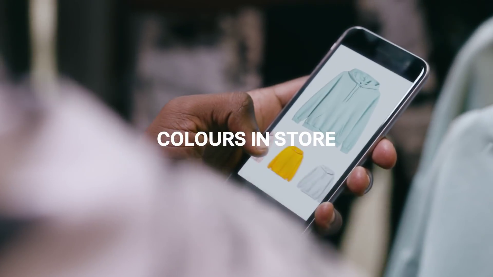
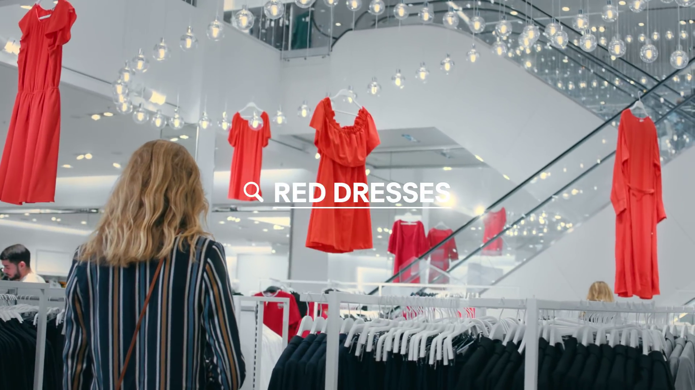

A new shopping experience! Activate [In-Store Mode](https://hmgroup.com/media/news/general-news-2019/h-m-climbs-to-second-place-in-retail-week-indicator.html) in the H&M App next time you're shopping in store. Connect to the store's assortment, see if the items you favourited online are in stock, find available sizes, colours and more.

<EmbedVideo
  width="wide"
  host="youtube"
  source="BCmtnDMzuzg"
  title="H&amp;M In-Store Mode"
  credit="© H&amp;M Group production"
/>

## Omni - backed by thousands of stores

With decades of crafted salesmanship, H&M has a solid foundation of thousands of stores around the globe where we meet our customers. Back in 2018, H&M's online store sales could not compete with offline store sales at all. Still, global shopping behaviour research conducted indicates that the boundary between online store and offline store start to intersect more frequently for H&M customers.

> ### "I discover things online, then I go to store to try on and see IRL.”​
> *Customer quote 2018*

Thanks to our solid foundation of stores network, in all markets where we operate digitally, there are physical stores presence in easy reach. Combining convenience of browsing large quantity of assortments online, with confident trying out garments in stores, customers make use of both channels' strengths to maximize their shopping experiences.

> ### "Customers come in every day, showing pictures and asking me to find items they’ve seen online.”​
> *Sales advisor quote 2018*​

These customers' behavioural shifts are also picked up by our sales advisors. However, our sales advisors are not yet equipped with digital empowerment tools that, quite often, such customers' requests are challenging to be fulfilled.

How can we empower both our customers as well as our sales advisors to seamlessly find what they are looking for?

## MVP and validation

Taking over above mentioned global research on customer offerings improvement, as senior UX designer, I worked on transforming these ambitions into tangible MVP (P for prototype) to validate the hypothesis.

The target context is set at when customers are in any of our physical stores. To faciliate a clear distinction of what our existing mobile application is and what this new functionality could be, we sketched out a layer that sits on top of the current application itself that we called a "mode". In this "mode", core interactions surround intentions of finding what customers want in current store, hiding away the rest of functionalities.

<EmbedImage width="wide">

</EmbedImage>

Challenges came from both internal process constraints as well as a new mental model of what this "mode" could be for end users. To better understand its potentials, in store contextual interviews were conducted, using mock-ups to observe and empathize how customers could connect ability enhancements through digital with well-known physical presence. In total, 26 customers and 9 sales advisors were interviewed in-depth right in our store, providing insights for further discussions.

The study cover these 4 key topics:

- Customers' current shopping preferences and behaviours both in-store and online
- Evaluate their perception towards this new "mode", as well as potentail usability pitfalls
- How can we communicate this new "mode" assuming its values are appreciated
- Co-creation of how we could improve this new "mode"

<EmbedImage width="wide">

</EmbedImage>

Analysis of the study shows that, these 5 existing customer offerings in the mobile application can be greatly enhanced with store context and store availability:

1. Text search -- e.g. searching for "evening dresses" and being able to see all evening dresses available at current store
2. Favourited items -- how many of my previously favourited items can be found in current store that I can have a closer look
3. Scan product tag -- show me all available sizes, as well as what to style with together
4. H&M Club -- what perks I have as a loyal customer at current store
5. Visual search -- can I find a similar item right here right now

Most importantly, we aimed at understand what customer would expect benefit from using such functionality. Customers and sales advisors say:

> ### "Then I know what I can bring home today.”
> *Customer quote 2018*

> ### "Sort of the thing I’m looking for… linking online and the shop.”
> *Customer quote 2018*

> ### "This is useful from both sides. We’ll be quicker and customers will know what to expect when coming to us.”
> *Sales advisor quote 2018*

## Synthesis and release

During above user studies, not only did we cover topics around valuable functionalities, but also how customer could mentally understand what we offer to them. Several potential names were put forward to customers, and **"In-Store Mode"** best describes that it is a functionality that covers on top of existing possibilities, but also, the context of usage is in physical stores.

<EmbedImage width="wide">

</EmbedImage>

Balancing between efforts needed and to release as fast as possible in order to learn from our customers, our first releasable version comes down to **"In-Store Mode"** that requires manual activation instead of automatic geo-location based activation. Though during the manual activation process, the cloest store to the user will be shown. Besides this barrier, we are able to cover almost all functionalities that would benefit a customer's store visit, including such as text search and my favourited items with store availability.

<EmbedImage width="wide">

</EmbedImage>

After **In-Store Mode** was released for a week, we have gathered:

- 10% of all app users have tried **In-Store Mode**
- 25% ISM users are returning customers
- 10% increase in app downloads (compared to same month previous year)

## Key takeaways

**In-Store Mode** is a proxy for us to try out and learn from true scenarios. What matters to a customer is endless convenience opportunities through being open and transparent of our own knowledge as a company. In this case, store availability (even online availability) has been seen as a protected internal asset. By openly share what we know, even though sometimes the data is incorrect due to the complexity of physical store's environment, it improves customers' overall experience and gains their trust that contributes to long term relationship building.

<EmbedImage credit="© H&amp;M Group production">

</EmbedImage>

<EmbedImage credit="© H&amp;M Group production">

</EmbedImage>

<EmbedImage credit="© H&amp;M Group production">

</EmbedImage>
