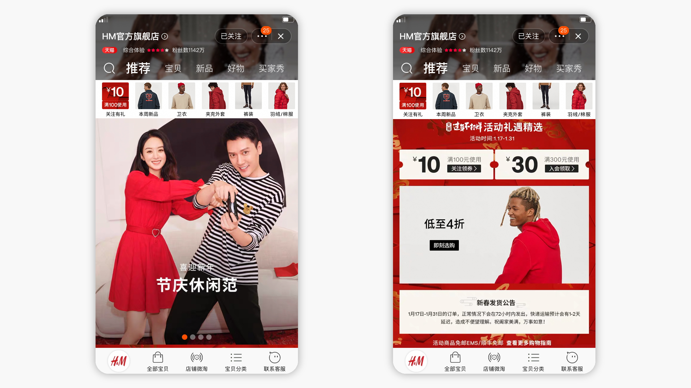
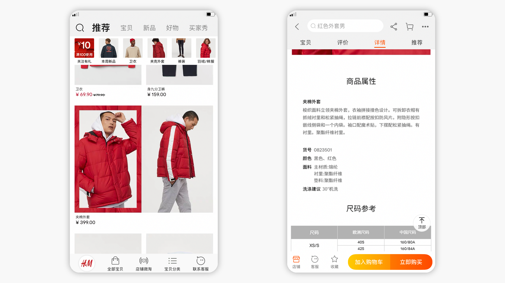

import EmbedVideo from "components/mdx/embedVideo"
import EmbedImage from "components/mdx/embedImage";

H&M, is now on one of the world’s largest e-commerce platforms, [Tmall](https://hm.tmall.com/).

As the lead UX designer, the key challenge is to bridge existing global identity and interaction pattern with local's shopping conventions, with my cross-cultural background.

<EmbedVideo
  width="wide"
  host="youtube"
  source="yqYMAdz_ZvI"
  title="H&M × Tmall"
  credit="© H&M Group production"
/>

Still, it is an opportunity to break out from "rigid" global platform, trying out new approaches then feed back to own design system.

Together with local team, we set up a launch framework based on global design system, which is close to existing own platform's shopping pattern. Over time, local team is guided towards more freedom, adapting to what Tmall's constantly evolving system, while maintaining a familiar brand's taste.

<EmbedImage width="wide">

</EmbedImage>

<EmbedImage width="wide">

</EmbedImage>
