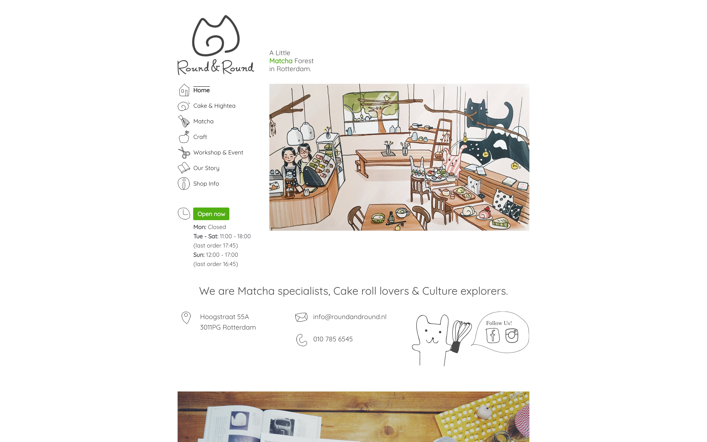

> ### Client
> [Round&Round Rotterdam](https://roundandround.nl/)
> ### Source Code
> [Github](https://github.com/xmflsct/rar-website)

Built, maintained and improved over 4 years time, this project serves as a forefront to excite customers.

It started as a Wordpress based project. And recently it has been full re-written using React that becomes static (with dynamic online order support), which conserves unnecessary energy of running a full dynamic site, for a better world.

<EmbedImage width="wide" website>

</EmbedImage>

<EmbedImage width="wide" website>

</EmbedImage>

<EmbedImage width="wide" website>

</EmbedImage>

<EmbedImage width="wide" website>

</EmbedImage>