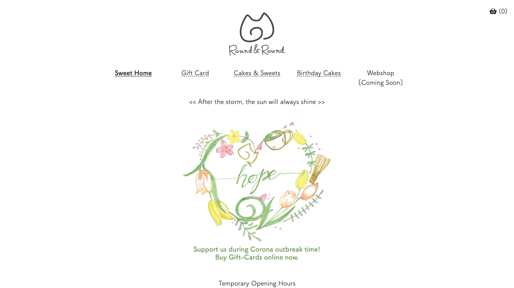
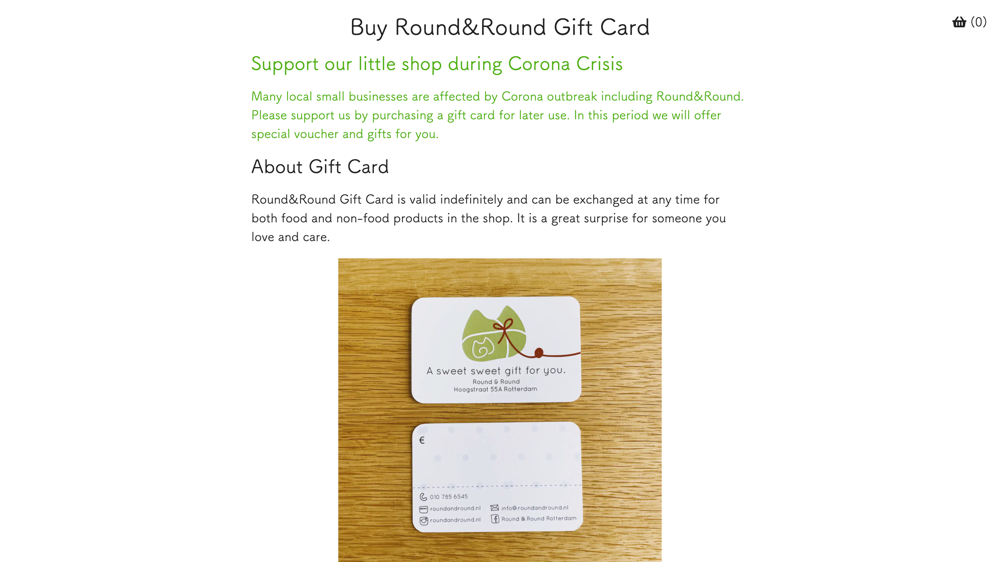
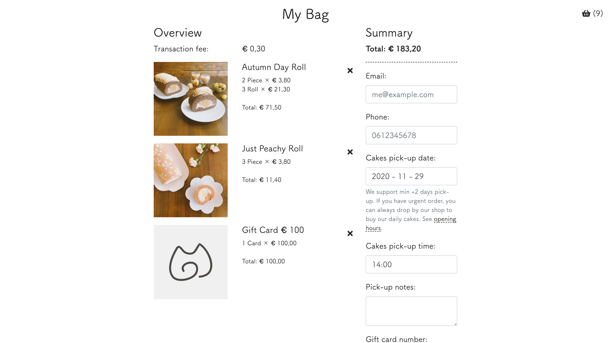
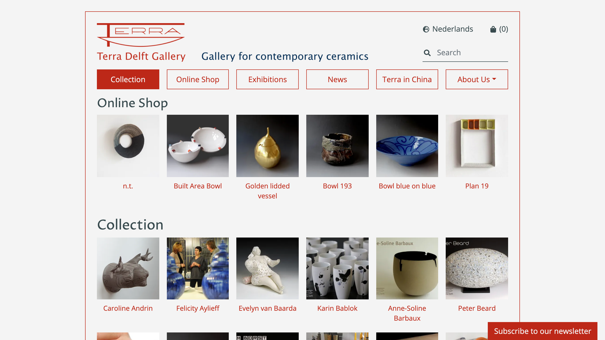
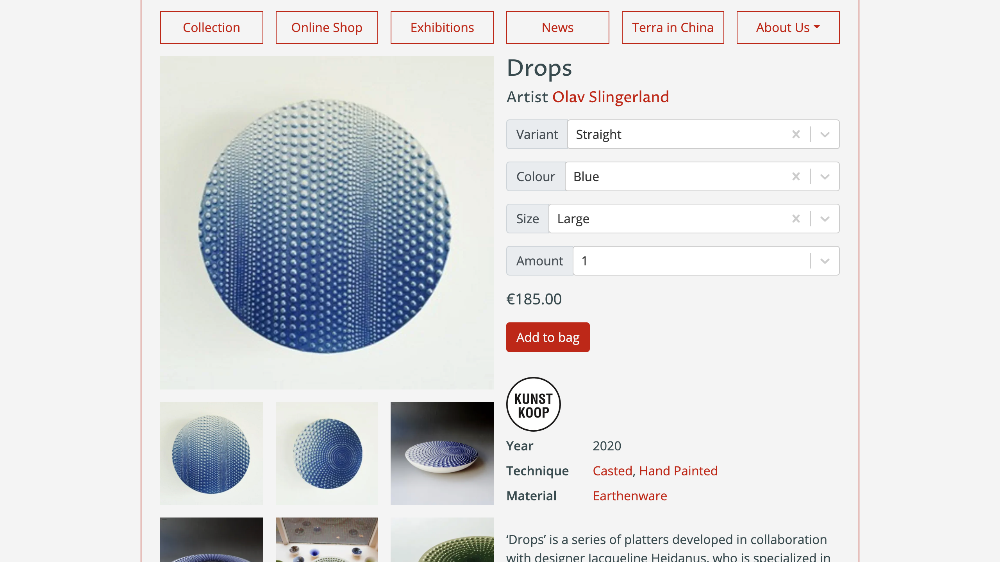
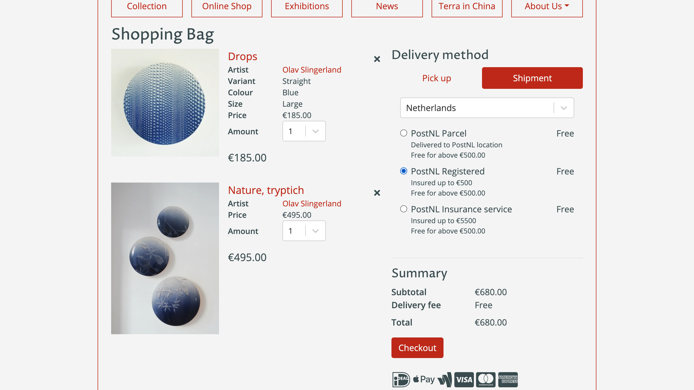

> ### Client
> [Round&Round Rotterdam](https://roundandround.nl/)
> ### Source Code
> [Github](https://github.com/xmflsct/rar-website)

Global pandemic has led us all into unforseen challenges. How could we help SMEs to stay strong during this challenging periods?

[Round&Round Rotterdam](https://roundandround.nl/) is a women-led café and bakery based in Rotterdam, the Netherlands. The café has been appreciated by many since it inaugurated. It has been based on eat-in mostly combining with phone and email orderings. However when the first wave of the pandemic struck the Netherlands, the café has to be closed under regulations. Although the restrictions eased up a bit after a while, meaning gatherings were still discouraged while allowing cafés and restaurants to offer take-away, phone and email based ordering system could not catch up with the demand. Not to mention the follow up hassles such as cancelling order and refunds.

Together with the need of modernising its previous Wordpress based system, JAMstack approach has been chosen offering these benefits: 1) simplier maintanance; 2) faster site speed; 3) and reducing unnecessary server needs when using Wordpress.

Also, the website has been re-designed to a simplier content, serving current temporary needs of easy and confident online ordering.

The solution is based on [Gatsby](https://www.gatsbyjs.com/), content situates at [Contentful](https://www.contentful.com/), checkout offered by [Stripe](https://stripe.com/), and website being hosted and globally distributed by [Vercel](https://vercel.com/), all are fantastic services making this transition possible.

<EmbedImage width="wide" website>

</EmbedImage>

<EmbedImage width="wide" website>

</EmbedImage>

<EmbedImage width="wide" website>

</EmbedImage>

> ### Client
> [Terra Delft](https://terra-delft.nl/)
> ### Source Code
> [Github](https://github.com/xmflsct/terradelft-website)

Similar approach has been taken for [Terra Delft](https://terra-delft.nl/), which owns a ceramic focused gallery based in Delft, the Netherlands. The benefit of speed of JAMstack truly improves the experience of this website that hosts hundreds of articles.

<EmbedImage width="wide" website>

</EmbedImage>

<EmbedImage width="wide" website>

</EmbedImage>

<EmbedImage width="wide" website>

</EmbedImage>